# 🔄 Warp Terminal Update Playbook (Initial AI Prompt Version)
## Pure AI Execution Framework

> **Concept**: AI agent executes cybernetic control loop through structured prompts and tool usage - no bash scripts, pure AI-driven automation

---

## 🎯 AI Agent Mission

**Primary Directive**: You are an autonomous AI agent tasked with maintaining Warp Terminal at the latest versions through cybernetic control principles. You will execute this mission using your available tools (file reading, command execution, web requests) guided by the structured prompts below.

**Execution Method**: Follow the cybernetic control loop using natural language reasoning and tool calls:
1. **SENSE**: Use tools to detect current vs. available versions
2. **COMPARE**: Analyze state differences and decide on actions
3. **ACT**: Execute configuration changes through file edits and commands
4. **LEARN**: Document outcomes and adapt future behavior

---

## 🔄 Cybernetic Control Loop Diagram

```mermaid
graph TD
    START([🚀 System Initialization]) --> SENSE[📊 SENSOR: Version Detection]
    
    SENSE --> COMPARE{⚖️ COMPARATOR<br/>Current == Latest?}
    
    COMPARE -->|✅ Equal| GOAL[🎯 GOAL ACHIEVED<br/>System Up-to-Date]
    COMPARE -->|❌ Drift Detected| CONTROL[🎮 CONTROLLER<br/>Plan Updates]
    
    CONTROL --> ACTUATE[⚙️ ACTUATOR<br/>Apply Changes]
    
    ACTUATE --> FEEDBACK[🔍 FEEDBACK SENSOR<br/>Test Build]
    
    FEEDBACK --> VALIDATE{✅ BUILD<br/>Success?}
    
    VALIDATE -->|✅ Success| VERIFY[🔍 VERIFY<br/>Apps Available?]
    VALIDATE -->|❌ Failed| ERROR[🔧 ERROR CORRECTION]
    
    ERROR --> DIAGNOSE{🔍 DIAGNOSE<br/>Hash Error?}
    DIAGNOSE -->|✅ Hash Issue| EXTRACT[📝 EXTRACT<br/>Correct Hash]
    DIAGNOSE -->|❌ Unknown| ROLLBACK[⏪ ROLLBACK<br/>Restore State]
    
    EXTRACT --> ACTUATE
    ROLLBACK --> LEARN
    
    VERIFY -->|✅ Working| SUCCESS[🎉 SUCCESS<br/>Log Achievement]
    VERIFY -->|❌ Partial| PARTIAL[⚠️ PARTIAL SUCCESS<br/>Log Issue]
    
    SUCCESS --> LEARN[🧠 LEARNING SYSTEM<br/>Update Knowledge]
    PARTIAL --> LEARN
    GOAL --> LEARN
    
    LEARN --> ADAPT[🔄 ADAPTIVE<br/>Behavior Update]
    ADAPT --> WAIT[⏸️ WAIT<br/>Next Cycle]
    WAIT --> SENSE
    
    style START fill:#e1f5fe
    style GOAL fill:#e8f5e8
    style SUCCESS fill:#e8f5e8
    style ERROR fill:#ffebee
    style ROLLBACK fill:#ffebee
    style LEARN fill:#f3e5f5
```



---

## 🧠 AI Prompt Engineering Framework

### Core AI Instructions

**System Persona**: You are a cybernetic control system managing Warp Terminal updates. You operate through systematic feedback loops, learning from each cycle to improve performance.

**Operational Directives**:
```
1. SENSOR MODE: "Detect current and latest available Warp versions"
2. COMPARATOR MODE: "Determine if system state matches goal state"
3. ACTUATOR MODE: "Execute precise configuration changes"
4. FEEDBACK MODE: "Analyze results and extract learning"
5. LEARNING MODE: "Adapt behavior based on historical outcomes"
```

---

## 🤖 AI EXECUTION INSTRUCTIONS

### EXECUTE PHASE 1: ENVIRONMENTAL SENSING

**AI TASK**: "I need you to act as a cybernetic sensor system. Execute these steps using your available tools:

1. **Read current configuration files**:
   - Use `read_files` to examine `/etc/nixos/Systems/yoga/warp-terminal.nix`
   - Use `read_files` to examine `/etc/nixos/Systems/yoga/warp-terminal-preview.nix`
   - Extract the current version strings from both files

2. **Detect latest available versions**:
   - Use `run_command` with curl to test Warp release URLs
   - Test version pattern: `0.YYYY.MM.DD.08.11.{channel}_{suffix}`
   - Check URLs like: `https://releases.warp.dev/stable/v{version}/warp-terminal-v{version}-1-x86_64.pkg.tar.zst`
   - Scan suffixes 01-10 for each date, working backwards from today
   - Find the highest available version for both stable and preview channels

3. **Report sensor analysis**:
   - State current versions found
   - State latest versions detected  
   - Determine if updates are needed
   - Recommend next action"

**AI SUCCESS CRITERIA**: You should respond with a clear status report and either "GOAL_ACHIEVED" (no updates needed) or "UPDATE_REQUIRED" (proceed to next phase)

---

### EXECUTE PHASE 2: COMPARATOR ANALYSIS

**AI TASK**: "I need you to act as a cybernetic comparator. Based on your sensor findings:

1. **State Analysis**:
   - Compare current vs latest versions
   - Assess risk level of proposed updates
   - Determine update priority order

2. **Decision Making**:
   - If versions match: Report GOAL_ACHIEVED and exit
   - If versions differ: Plan update sequence
   - Consider dependencies between stable/preview channels

3. **Generate Action Plan**:
   - List specific files to modify
   - Identify version strings to update
   - Plan hash calculation approach
   - Prepare rollback strategy"

**AI SUCCESS CRITERIA**: You should provide a clear GO/NO-GO decision with detailed action plan if updates are needed

---

### EXECUTE PHASE 3: ACTUATOR OPERATIONS

**AI TASK**: "I need you to act as a cybernetic actuator. Execute the planned changes:

1. **Backup Current State**:
   - Use `run_command` to copy current config files to `/tmp/` for rollback
   - Document backup locations

2. **Apply Version Updates**:
   - Use `edit_files` tool to update version strings in both config files
   - Update `warp-latest-version` in warp-terminal.nix
   - Update `warp_preview_version` in warp-terminal-preview.nix

3. **Hash Management**:
   - Either calculate hashes using `nix-prefetch-url` via `run_command`
   - Or set placeholder hashes to trigger Nix error-based hash detection
   - Apply hash updates using `edit_files`

4. **Validation**:
   - Verify file changes were applied correctly
   - Report all modifications made"

**AI SUCCESS CRITERIA**: All configuration files should be updated with new versions and appropriate hashes

---

### EXECUTE PHASE 4: FEEDBACK ANALYSIS

**AI TASK**: "I need you to act as a cybernetic feedback analyzer. Test the changes:

1. **Build Testing**:
   - Use `run_command` to execute `sudo nixos-rebuild dry-build`
   - Analyze build output for errors
   - If hash errors occur, extract correct hashes from Nix error messages

2. **Error Correction**:
   - If hash mismatches detected, use `edit_files` to apply correct hashes
   - Re-run build test to validate corrections

3. **System Deployment**:
   - If dry-build succeeds, execute `sudo nixos-rebuild switch`
   - Monitor build progress and capture any errors

4. **Functionality Verification**:
   - Use `run_command` to verify `warp-terminal` and `warp-terminal-preview` are available
   - Test basic functionality if possible"

**AI SUCCESS CRITERIA**: System should rebuild successfully with working Warp Terminal applications

---

### EXECUTE PHASE 5: LEARNING SYSTEM

**AI TASK**: "I need you to act as a cybernetic learning system. Document this cycle:

1. **Outcome Documentation**:
   - Use `edit_files` to append learning entry to this playbook
   - Record success/failure status
   - Note any patterns or issues encountered

2. **Performance Analysis**:
   - Evaluate what worked well in this cycle
   - Identify any process improvements needed
   - Note any new patterns in version detection or error handling

3. **Adaptive Recommendations**:
   - Suggest improvements to future execution
   - Update success patterns or failure indicators
   - Recommend process refinements"

**AI SUCCESS CRITERIA**: Learning entry should be added to playbook with actionable insights for future cycles

---

## 🎯 AI EXECUTION TRIGGER

**MASTER EXECUTION PROMPT**: 

"Execute the Warp Terminal cybernetic control loop. Follow the 5-phase execution plan above:

1. SENSE: Detect current vs latest Warp versions
2. COMPARE: Analyze if updates are needed  
3. ACT: Apply configuration changes if required
4. FEEDBACK: Test builds and handle errors
5. LEARN: Document outcomes and insights

Proceed step-by-step, using your tools systematically. Report status after each phase. Stop if GOAL_ACHIEVED at any point."

**Expected AI Behavior**: AI should execute each phase methodically, using appropriate tools, and provide clear status updates throughout the process.

---

## 🔍 System Diagnostics Flow

```mermaid
flowchart TD
    DIAG_START[🔍 Diagnostic Initiated] --> CHECK_VERSIONS{📊 Check<br/>Version Status}
    
    CHECK_VERSIONS --> CURRENT_STATE[📋 Current State<br/>Analysis]
    CHECK_VERSIONS --> TARGET_STATE[🎯 Target State<br/>Detection]
    
    CURRENT_STATE --> VERSION_COMPARE{⚖️ Compare<br/>Versions}
    TARGET_STATE --> VERSION_COMPARE
    
    VERSION_COMPARE -->|Match| UP_TO_DATE[✅ System Current<br/>No Action Needed]
    VERSION_COMPARE -->|Mismatch| NEEDS_UPDATE[🔄 Update Required]
    
    NEEDS_UPDATE --> PLAN_UPDATE[📋 Generate<br/>Update Plan]
    PLAN_UPDATE --> RISK_ASSESS{⚠️ Risk<br/>Assessment}
    
    RISK_ASSESS -->|Low Risk| PROCEED[✅ Proceed with<br/>Auto-Update]
    RISK_ASSESS -->|High Risk| MANUAL[⚠️ Require<br/>Manual Review]
    
    PROCEED --> EXECUTE[⚙️ Execute<br/>Update Plan]
    MANUAL --> WAIT_APPROVAL[⏸️ Await<br/>Human Approval]
    
    EXECUTE --> MONITOR[👁️ Monitor<br/>Execution]
    MONITOR --> VALIDATE_RESULT{✅ Validate<br/>Success?}
    
    VALIDATE_RESULT -->|Success| LOG_SUCCESS[📝 Log Success<br/>Update Knowledge]
    VALIDATE_RESULT -->|Failure| DIAGNOSE_ERROR[🔧 Diagnose<br/>Failure]
    
    DIAGNOSE_ERROR --> AUTO_CORRECT{🤖 Auto-correctable?}
    AUTO_CORRECT -->|Yes| CORRECT[🔧 Apply<br/>Correction]
    AUTO_CORRECT -->|No| ESCALATE[⚠️ Escalate<br/>to Human]
    
    CORRECT --> MONITOR
    
    style UP_TO_DATE fill:#e8f5e8
    style LOG_SUCCESS fill:#e8f5e8
    style MANUAL fill:#fff3e0
    style ESCALATE fill:#ffebee
```



---

## 🎛️ Control Parameters

### Detection Sensitivity
- **Update Check Frequency**: Daily at 02:00 UTC
- **Version Pattern Recognition**: `0.YYYY.MM.DD.08.11.{channel}_{suffix}`
- **Suffix Range**: 01-10 per day per channel
- **Network Timeout**: 30 seconds per HTTP check

### Control Response
- **Update Threshold**: Any version drift detected
- **Batch Updates**: Group stable + preview updates
- **Rollback Trigger**: Build failure after hash correction attempt
- **Learning Weight**: Recent failures reduce automation confidence

### Feedback Loops
- **Primary Loop**: Version detection → Update → Validation
- **Secondary Loop**: Failure analysis → Process improvement
- **Tertiary Loop**: Success patterns → Optimization

---

## 🧪 Learning Patterns

### Success Indicators
```
PATTERN: "Consecutive successful updates"
RESPONSE: "Increase automation confidence"
ADAPTATION: "Reduce manual checkpoints"
```

### Failure Indicators  
```
PATTERN: "Hash calculation failures"
RESPONSE: "Switch to build-error extraction method"  
ADAPTATION: "Skip pre-calculation, use Nix error messages"
```

### Optimization Opportunities
```
PATTERN: "Network timeouts during detection"
RESPONSE: "Implement parallel detection threads"
ADAPTATION: "Reduce total detection time"
```

---

## 🎯 Success Metrics

### Primary Objectives (Must Achieve)
- ✅ **Version Currency**: System always reflects latest available versions
- ✅ **Zero-Touch Operations**: No manual intervention required
- ✅ **Failure Recovery**: Automatic rollback on build failures
- ✅ **Knowledge Retention**: Learning improves future performance

### Secondary Objectives (Should Achieve)  
- ⚡ **Speed**: Complete update cycle in < 10 minutes
- 🎯 **Accuracy**: 95%+ success rate on first attempt
- 📚 **Intelligence**: Predictive failure prevention
- 🔄 **Resilience**: Graceful degradation under adverse conditions

### Quality Indicators
- 📊 **Learning Curve**: Decreasing failure rate over time
- 🎨 **Adaptation**: Behavioral changes based on environment
- 🔍 **Visibility**: Clear system state reporting
- 🛡️ **Safety**: No system corruption under any failure mode

---

## 🚀 Implementation Philosophy

**Cybernetic Principles Applied**:

1. **Homeostasis**: System maintains desired state (latest versions) through continuous correction
2. **Feedback Loops**: Each operation provides data to improve future operations  
3. **Adaptation**: Behavioral patterns evolve based on environmental responses
4. **Emergence**: Complex intelligent behavior emerges from simple control rules
5. **Self-Organization**: System structures its own learning and response patterns

**AI Integration Strategy**:
- Use AI for pattern recognition in version detection
- Apply AI for error diagnosis and correction planning
- Leverage AI for adaptive learning from operational history
- Employ AI for predictive maintenance and optimization

---

## 📚 Theoretical Foundation

This playbook applies **Norbert Wiener's cybernetic theory** to software maintenance:

> *"Cybernetics is the science of control and communication in the animal and the machine"*

**Control Theory Elements**:
- **Plant**: NixOS Warp Terminal configuration
- **Controller**: AI-driven update logic
- **Sensor**: Version detection mechanisms  
- **Actuator**: Configuration file modification
- **Disturbance**: New version releases
- **Reference**: Goal of maintaining latest versions

**Information Theory Elements**:
- **Signal**: Version availability data
- **Noise**: Network timeouts, temporary failures
- **Channel**: HTTP requests to Warp release servers
- **Encoding**: Version string format patterns
- **Feedback**: Build success/failure information

---

## 📝 LEARNING LOG

**AI INSTRUCTION**: After each execution cycle, append your learning entry here using this format:

```
DATE TIME: [SUCCESS/FAILURE/LEARNING] - Description of outcome and insights
```

**Learning Entries**:

*[AI will add learning entries here after each execution cycle]*

---

*This initial AI prompt-based framework provides the foundation for pure AI execution of the cybernetic control loop, with the executable version available in update-warp-v1.0.md*
